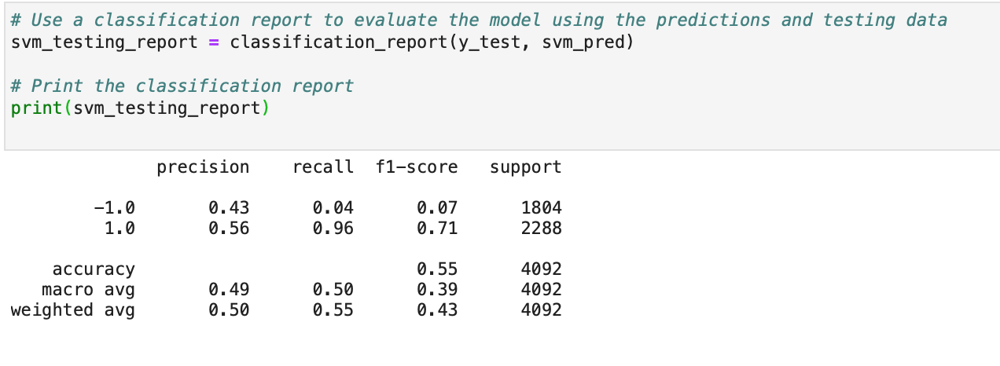
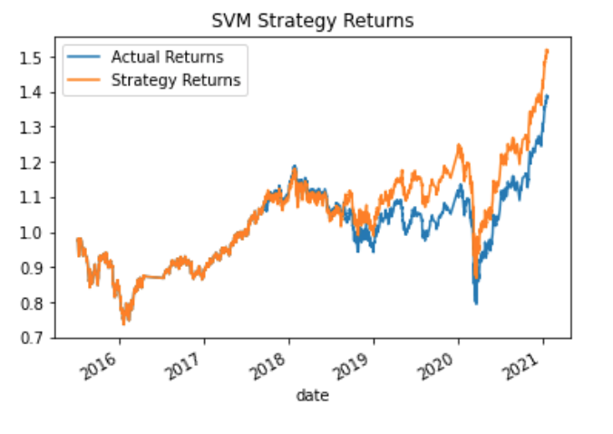
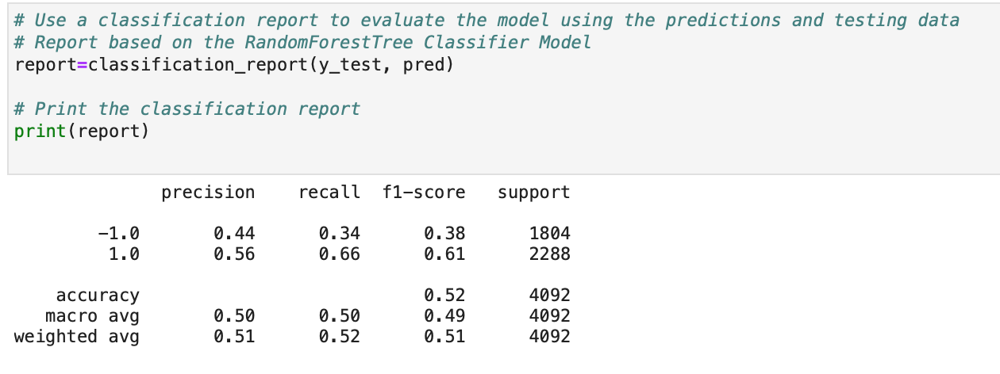
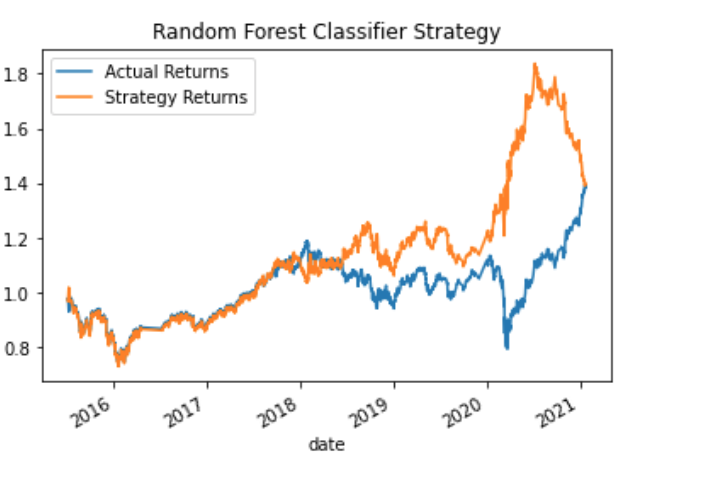

# Algorithmic trading with machine learning algortihms
This project implements an algorithmic trading strategy that uses machine learning to automate the trade decisions.
It adjust the input parameters to optimize the trading algorithm.
Moreover, a different machine learning models are being tested out  and its performances compared against that of a baseline model.

# Dataset 

The dataset contains an OHLCV dataset covering the period of 2015-01-21 till 2021-01-22.

# Required libraries and dependencies
 ```python
import pandas as pd
import numpy as np
from pathlib import Path
import hvplot.pandas
import matplotlib.pyplot as plt
from sklearn import svm
from sklearn.preprocessing import StandardScaler
from pandas.tseries.offsets import DateOffset
from sklearn.metrics import classification_report
```
# Examples 

Report associated with SVC model predictions 



---

Comparing the actual and SVM predicted returns 




---

Report associated with Random Forest model predictions 



---

Comparing the actual and SVM predicted returns



# Summary
The SVM model achieved greater accuracy and produced much higher cumulative returns than the RandomForestClassifier

## Contributors
Brought to you by Ksenia Gorska as part of the UC Berkeley Extension Bootcamp: UCB-VIRT-FIN-PT-06-2021-U-B-MW Ksenia Gorska
 e-mail: kseniagorska@icloud.com 

[linkedin](https://www.linkedin.com/in/ksenia-gorska/)

## License

MIT